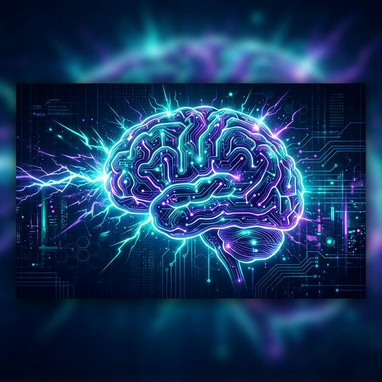

# NeuroSpike-BCI 🧠⚡



> **Closed-Loop Spiking Neural Networks for Speech Rehabilitation.**

NeuroSpike-BCI is a prototype repository for a longitudinal, rehabilitative Brain-Computer Interface (BCI). It leverages **Spiking Neural Networks (SNN)** to decode imagined speech from high-density EEG signals, facilitating a closed-loop system for neural recovery.

---

## 🚀 Research Workflow

The project follows a three-stage clinical deployment strategy:

1.  **The Baseline (Perception):** Use "Listening" EEG data as the anchor. SNNs excel here due to their ability to process temporal spikes.
2.  **The Bridge (Co-Adaptation):** Transfer learning from perception models to imagined speech tasks.
3.  **The Loop (Rehabilitation):** A closed-loop system where decoded spikes trigger auditory feedback, reinforcing neural pathways.

---

## ✨ Core Features

-   **Temporal Dominance:** Uses Leaky Integrate-and-Fire (LIF) neurons for high-fidelity temporal processing.
-   **Neural Synchrony:** Aligns SNN spikes with rhythmic high-gamma activity in the ventral sensorimotor cortex (vSMC).
-   **Real-time Feedback:** Low-latency decoding for instantaneous speech synthesis.
-   **Longitudinal Tracking:** Tools for monitoring patient progress over 5hr/week clinical sessions.

---

## 📂 Repository Structure

```text
├── 📂 data/
│   ├── 📂 processed/      # BIDS-formatted EEG spike trains
│   └── 📂 raw/            # Raw EEG (UCSF / BRAVO Style)
├── 📂 models/
│   ├── 🐍 snn_encoder.py  # Spiking CNN + Recurrent Architecture
│   └── 🐍 viterbi_decoder.# Viterbi-corrected language modeling
├── 📂 src/
│   ├── 📂 encoding/       # Delta modulation & Step-forward encoding
│   ├── 📂 training/       # Surrogate gradient descent (snntools)
│   └── 📂 interface/      # PyQt-based real-time feedback UI
├── 📂 research_docs/      # Tracking logs & clinical framework
└── 🖼 assets/             # Branding & documentation media
```

---

## 🧠 Architecture: The Spiking Logic

We utilize a **Leaky Integrate-and-Fire (LIF)** neuron model. Unlike standard ANNs, our model processes binary spikes over time, mimicking natural neural firing.

### Logic Flow

1.  **Signal to Spikes:** 128-ch EEG → Delta Modulation.
2.  **Spatial Extraction:** Spiking CNN layer extracts patterns from Broca's/Motor areas.
3.  **Temporal Integration:** Spiking Recurrent layer (SRNN) processes the phonemic sequence.
4.  **Speech Synthesis:** Decoded spikes → Phoneme-to-Speech synthesizer.

### Model Prototype (PyTorch + snnTorch)

```python
import torch
import torch.nn as nn
import snntorch as snn
from snntorch import surrogate

class SpikingSpeechDecoder(nn.Module):
    def __init__(self, num_channels=128, hidden_size=256, num_phonemes=40):
        super().__init__()
        
        # 1. Spatial Feature Extraction (Spiking Conv)
        self.conv1 = nn.Conv1d(num_channels, 64, kernel_size=5, stride=2)
        self.lif1 = snn.Leaky(beta=0.9, spike_grad=surrogate.fast_sigmoid())
        
        # 2. Temporal Sequence Processing (Spiking Recurrent)
        self.rnn = nn.RNN(64, hidden_size, batch_first=True)
        self.lif2 = snn.Leaky(beta=0.9, spike_grad=surrogate.fast_sigmoid())
        
        # 3. Output Layer
        self.fc = nn.Linear(hidden_size, num_phonemes)
        self.lif3 = snn.Leaky(beta=0.9, spike_grad=surrogate.fast_sigmoid())

    def forward(self, x):
        # x shape: (batch, time_steps, channels)
        mem1 = self.lif1.init_leaky()
        mem2 = self.lif2.init_leaky()
        mem3 = self.lif3.init_leaky()
        
        spk_out_hist = []
        
        for step in range(x.size(1)): 
            cur_x = x[:, step, :].unsqueeze(2) 
            
            # Layer 1: Spatial Patterns
            x_conv = self.conv1(cur_x).squeeze(2)
            spk1, mem1 = self.lif1(x_conv, mem1)
            
            # Layer 2: Temporal Integration
            out_rnn, _ = self.rnn(spk1.unsqueeze(1))
            spk2, mem2 = self.lif2(out_rnn.squeeze(1), mem2)
            
            # Layer 3: Phoneme Decode
            out_fc = self.fc(spk2)
            spk3, mem3 = self.lif3(out_fc, mem3)
            
            spk_out_hist.append(spk3)
            
        return torch.stack(spk_out_hist, dim=1) 
```

---

## 📈 Evaluation Metrics

| Metric | Description | Goal |
| :--- | :--- | :--- |
| **Neural Synchrony** | Alignment with high-gamma bursts | > 0.85 Cross-Corr |
| **Word Error Rate** | WER after Viterbi correction | < 15% |
| **Plasticity Index** | Decrease in decoding latency | Longitudinal Decr. |

---

## 🛠 Built With


---

> [!NOTE]
> Created for the **UCSF-collaboration framework** for Speech Neuroprosthetics.
